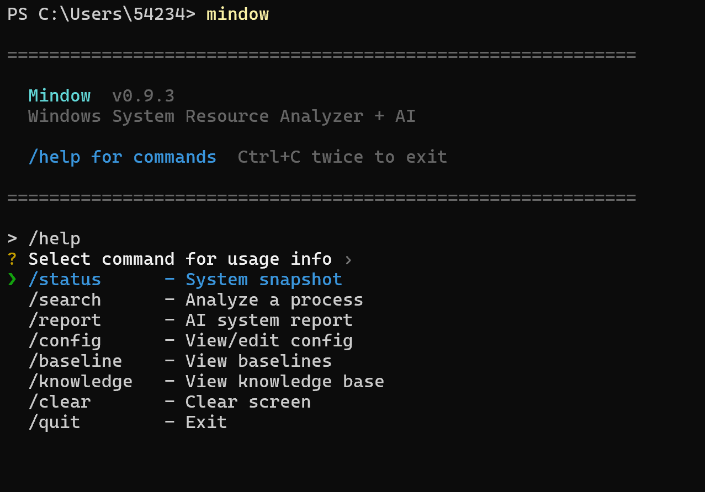

# Mindow

> Mind + Window — AI 驱动的 Windows 系统资源分析工具
>
> 单个 exe，零依赖，纯 Rust 实现。

## 特性

- **进程监控** — 内存、CPU 实时采集，同名进程自动合并（像任务管理器一样）
- **规则引擎** — 内存泄漏检测、持续高 CPU 告警、内存压力告警、低电量智能建议
- **AI 分析** — 可接入 OpenAI / Claude / DeepSeek 等 API，自然语言解释系统状态
- **进程搜索** — `mindow search chrome`，AI 告诉你这个进程是什么、正不正常
- **知识库** — 查过的进程本地缓存，下次秒回
- **基线学习** — 越用越懂你的电脑，记录每个进程的历史内存/CPU
- **交互模式** — 输入 `mindow` 进入 REPL，随时问 AI 关于系统的问题
- **流式输出** — AI 回答实时逐字显示
- **彩色终端** — 进度条、着色、分组，一眼看出重点

## 安装

### 下载可执行文件

从 [Releases](https://github.com/maverickxone/mindow/releases) 页面下载 `mindow.exe`，放到任意目录即可运行。

### 从源码安装

```bash
cargo install --git https://github.com/maverickxone/mindow.git --bin mindow
```

## 快速开始

```powershell
# 进入交互模式（推荐）
mindow

# 或者单次执行
mindow status          # 系统快照
mindow watch           # 持续监控
mindow search chrome   # AI 分析某个进程
mindow report          # AI 深度报告（需要配置 API key）
```

## 配置 AI（可选）

不配置 AI 也能使用 `status`、`watch` 功能。配置后解锁 `report`、`search`、自由对话。

```powershell
mindow config set provider openai
mindow config set model deepseek-v4-pro
mindow config set api_key sk-你的密钥
mindow config set base_url https://api.deepseek.com
```

配置文件位置：`~/.mindow/config.toml`

支持任何 OpenAI 兼容 API（DeepSeek、SiliconFlow、Ollama 本地等）和 Claude 原生 API。

## 命令一览

| 命令 | 说明 |
|------|------|
| `mindow` | 进入交互模式（REPL） |
| `mindow status` | 系统快照 |
| `mindow watch` | 持续监控（Ctrl+C 退出） |
| `mindow search <名字\|PID>` | AI 分析进程 |
| `mindow report` | AI 深度分析报告 |
| `mindow config show` | 显示配置 |
| `mindow config set <key> <value>` | 设置配置项 |
| `mindow config init` | 交互式配置 |
| `mindow baseline show` | 查看学习到的基线 |
| `mindow baseline reset` | 重置基线数据 |
| `mindow knowledge show` | 查看知识库缓存 |
| `mindow knowledge clear` | 清空知识库 |

## 参数

```
--top N              显示前 N 组进程（默认 25）
--sort mem|cpu|name  排序方式（默认 mem）
--interval N         watch 刷新间隔秒数（默认 10）
--all                显示全部进程
--no-color           禁用颜色
```

## 交互模式

输入 `mindow` 进入 REPL，支持：

- 斜杠命令：`/status`、`/search kiro`、`/report`、`/config`、`/baseline`、`/knowledge`
- 自由文本直接问 AI（自动附带系统快照作为上下文）
- 上下箭头翻历史，Ctrl+C 两次退出



## 架构

```
core/          系统数据采集、过滤、规则引擎（纯 Rust 库，无 AI 依赖）
mindow-cli/    CLI 界面 + AI 集成（二进制）
```

## 系统要求

- Windows 10/11 x64
- AI 功能需要网络 + API key（不配也能用基础监控功能）

## License

MIT

---

## English

**Mindow** — AI-powered Windows system resource analyzer. Single exe, zero dependencies, built with Rust.

Download `mindow.exe` from [Releases](https://github.com/maverickxone/mindow/releases). No installation required.

Features: real-time process monitoring, memory leak detection, sustained high CPU alerts, AI-powered process identification (supports OpenAI/Claude/DeepSeek), local knowledge caching, baseline learning.

Requires Windows 10/11 x64. AI features require an API key (any OpenAI-compatible endpoint).

```powershell
mindow              # Interactive mode (recommended)
mindow status       # System snapshot
mindow search chrome  # AI-powered process analysis
mindow report       # Full AI analysis report
```
